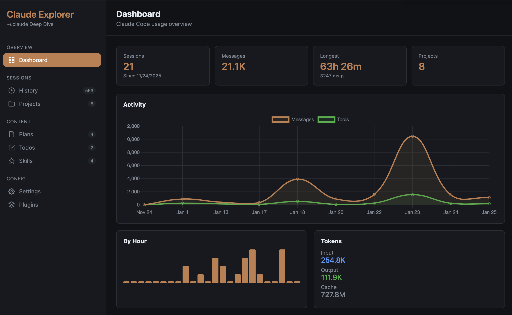
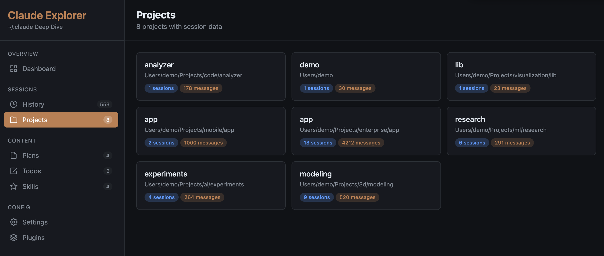
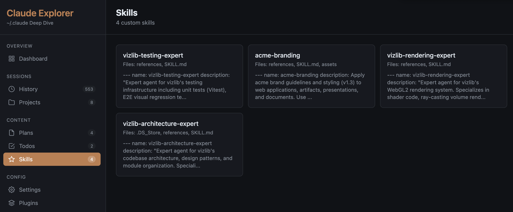
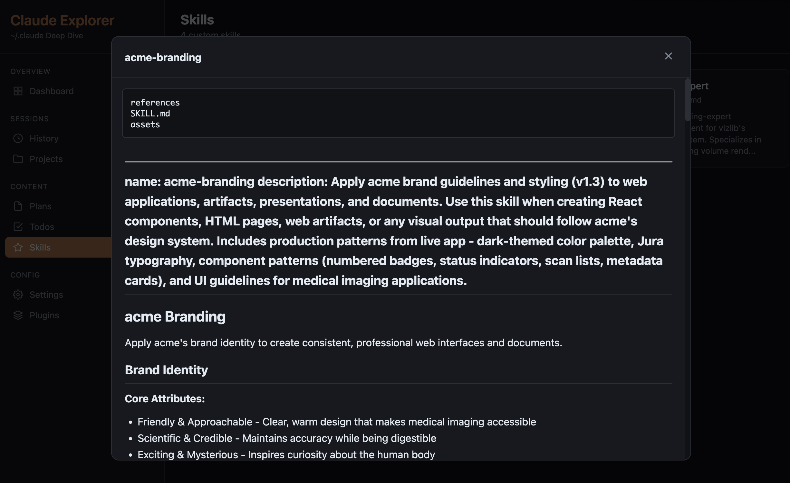

# Claude Explorer

An interactive dashboard for exploring your [Claude Code](https://claude.ai/code) session history, settings, plans, and usage statistics.


## Features

### Dashboard
Overview of usage statistics, activity charts, and token consumption.



### Session Explorer
Browse and read full conversation history from all your projects.



### Skills Browser
Explore custom skills and their configurations.





### Other Features
- **History Search** - Search and filter through your command history
- **Plans Viewer** - View saved implementation plans with Markdown rendering
- **Settings Inspector** - View your Claude Code configuration
- **Plugins Overview** - See installed plugins and marketplaces

## Installation

### Using Homebrew (macOS/Linux)

```bash
brew install kaymo-ai/claude-explorer/claude-explorer
```

### Using pip

```bash
pip install claude-explorer
```

### Manual Installation

```bash
# Clone the repository
git clone https://github.com/kaymo-ai/claude-explorer.git
cd claude-explorer

# Make executable and add to PATH
chmod +x claude-explorer
sudo ln -s $(pwd)/claude-explorer /usr/local/bin/claude-explorer
```

### Direct Download

```bash
# Download and run directly
curl -fsSL https://raw.githubusercontent.com/kaymo-ai/claude-explorer/main/claude-explorer -o claude-explorer
chmod +x claude-explorer
./claude-explorer
```

## Usage

### Basic Usage

```bash
# Generate and open the explorer in your browser
claude-explorer
```

This will:
1. Read data from `~/.claude`
2. Generate an interactive HTML dashboard
3. Save it to `~/claude-explorer.html`
4. Open it in your default browser

### Command Line Options

```
Usage: claude-explorer [OPTIONS]

Options:
  -V, --version           Show version number
  -d, --claude-dir PATH   Path to Claude directory (default: ~/.claude)
  -o, --output PATH       Output HTML file path (default: ~/claude-explorer.html)
  --no-open               Generate without opening browser
  --max-sessions N        Maximum sessions per project (default: 20)
  --max-messages N        Maximum messages per session (default: 500)
  -v, --verbose           Show detailed progress
  --json                  Output raw JSON data instead of HTML
  -h, --help              Show this help message
```

### Examples

```bash
# Generate explorer with verbose output
claude-explorer -v

# Save to a specific location
claude-explorer -o ~/Desktop/my-claude-history.html

# Generate without opening browser
claude-explorer --no-open

# Include more session history
claude-explorer --max-sessions 50 --max-messages 1000

# Export raw data as JSON
claude-explorer --json > claude-data.json

# Use a different Claude directory
claude-explorer -d /path/to/other/.claude
```

## What Data is Included?

Claude Explorer reads the following from your `~/.claude` directory:

| Data | Description |
|------|-------------|
| `settings.json` | Global Claude Code settings |
| `settings.local.json` | Local/machine-specific settings |
| `stats-cache.json` | Usage statistics (sessions, messages, tokens) |
| `history.jsonl` | Command/message history |
| `projects/` | Session transcripts organized by project |
| `plans/` | Saved implementation plans (Markdown) |
| `skills/` | Custom skills and their configurations |
| `todos/` | Task lists from sessions |
| `plugins/` | Installed plugins information |

## Privacy & Security

- **Local only**: All data stays on your machine. The generated HTML file contains embedded data and works completely offline.
- **No network requests**: The explorer makes no external API calls (Chart.js and Marked.js are loaded from CDN for rendering, but your data is never transmitted).
- **No tracking**: No analytics or telemetry of any kind.

## Requirements

- Python 3.8+
- Claude Code installed (`~/.claude` directory exists)

## Development

```bash
# Clone the repo
git clone https://github.com/kaymo-ai/claude-explorer.git
cd claude-explorer

# Run locally
./claude-explorer -v

# Run tests
python -m pytest tests/
```

## Contributing

Contributions are welcome! Please feel free to submit a Pull Request.

1. Fork the repository
2. Create your feature branch (`git checkout -b feature/amazing-feature`)
3. Commit your changes (`git commit -m 'Add amazing feature'`)
4. Push to the branch (`git push origin feature/amazing-feature`)
5. Open a Pull Request

## License

MIT License - see [LICENSE](LICENSE) for details.

## Acknowledgments

- Built for use with [Claude Code](https://claude.ai/code) by Anthropic
- Uses [Chart.js](https://www.chartjs.org/) for activity visualization
- Uses [Marked](https://marked.js.org/) for Markdown rendering
